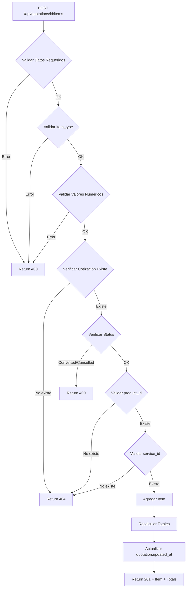

# 📋 API de Items de Cotizaciones - Documentación Completa

## 🎯 **RESUMEN**

Endpoints robustos para gestionar items de cotizaciones con validaciones exhaustivas, control de stock, y recálculo automático de totales.

---

## 🔗 **ENDPOINTS IMPLEMENTADOS**

### **GET /api/quotations/[id]/items**

Obtiene todos los items de una cotización con detalles completos de productos y servicios.

#### **Request:**
```http
GET /api/quotations/123e4567-e89b-12d3-a456-426614174000/items
```

#### **Response Exitosa (200):**
```json
{
  "data": {
    "quotation_id": "123e4567-e89b-12d3-a456-426614174000",
    "quotation_number": "Q-2024-0001",
    "items": [
      {
        "id": "item-uuid-1",
        "quotation_id": "123e4567-e89b-12d3-a456-426614174000",
        "item_type": "product",
        "product_id": "product-uuid-1",
        "description": "Filtro de aceite",
        "quantity": 2,
        "unit_price": 150.00,
        "discount_percent": 10,
        "discount_amount": 30.00,
        "tax_percent": 16,
        "subtotal": 300.00,
        "tax_amount": 43.20,
        "total": 313.20,
        "products": {
          "id": "product-uuid-1",
          "name": "Filtro de aceite premium",
          "code": "FLT-001",
          "price": 150.00
        }
      },
      {
        "id": "item-uuid-2",
        "quotation_id": "123e4567-e89b-12d3-a456-426614174000",
        "item_type": "service",
        "service_id": "service-uuid-1",
        "description": "Cambio de aceite",
        "quantity": 1,
        "unit_price": 500.00,
        "discount_percent": 0,
        "discount_amount": 0,
        "tax_percent": 16,
        "subtotal": 500.00,
        "tax_amount": 80.00,
        "total": 580.00,
        "services": {
          "id": "service-uuid-1",
          "name": "Cambio de aceite estándar",
          "base_price": 500.00
        }
      }
    ],
    "items_count": 2,
    "totals": {
      "subtotal": 800.00,
      "tax_amount": 123.20,
      "discount_amount": 30.00,
      "total_amount": 893.20
    }
  },
  "error": null
}
```

#### **Response de Error (404):**
```json
{
  "data": null,
  "error": "Cotización no encontrada"
}
```

#### **Características:**
- ✅ Verifica que la cotización existe
- ✅ Incluye detalles de productos (name, code, price)
- ✅ Incluye detalles de servicios (name, base_price)
- ✅ Retorna totales consolidados
- ✅ Retorna contador de items

---

## 📝 **POST /api/quotations/[id]/items**

Agrega un nuevo item a la cotización con validaciones exhaustivas y recálculo automático de totales.

### **Request:**
```http
POST /api/quotations/123e4567-e89b-12d3-a456-426614174000/items
Content-Type: application/json

{
  "item_type": "product",
  "product_id": "product-uuid-123",
  "description": "Filtro de aire",
  "quantity": 2,
  "unit_price": 200.00,
  "discount_percent": 5,
  "tax_percent": 16,
  "notes": "Recomendado cambio cada 15,000 km"
}
```

### **Campos del Request:**

| Campo | Tipo | Requerido | Descripción |
|-------|------|-----------|-------------|
| `item_type` | string | ✅ Sí | "product" o "service" |
| `description` | string | ✅ Sí | Descripción del item |
| `quantity` | number | ✅ Sí | Cantidad (> 0) |
| `unit_price` | number | ✅ Sí | Precio unitario (>= 0) |
| `product_id` | UUID | ❌ No | ID del producto (requerido si item_type='product') |
| `service_id` | UUID | ❌ No | ID del servicio (requerido si item_type='service') |
| `discount_percent` | number | ❌ No | Porcentaje de descuento |
| `discount_amount` | number | ❌ No | Monto fijo de descuento |
| `tax_percent` | number | ❌ No | Porcentaje de impuesto |
| `notes` | string | ❌ No | Notas adicionales |

### **Response Exitosa (201):**
```json
{
  "data": {
    "item": {
      "id": "item-uuid-new",
      "quotation_id": "123e4567-e89b-12d3-a456-426614174000",
      "item_type": "product",
      "product_id": "product-uuid-123",
      "description": "Filtro de aire",
      "quantity": 2,
      "unit_price": 200.00,
      "discount_percent": 5,
      "discount_amount": 20.00,
      "tax_percent": 16,
      "subtotal": 400.00,
      "tax_amount": 60.80,
      "total": 440.80,
      "created_at": "2024-01-20T15:30:00Z"
    },
    "quotation": {
      "id": "123e4567-e89b-12d3-a456-426614174000",
      "quotation_number": "Q-2024-0001",
      "subtotal": 1200.00,
      "tax_amount": 184.00,
      "discount_amount": 50.00,
      "total_amount": 1334.00,
      "updated_at": "2024-01-20T15:30:00Z"
    },
    "message": "Item agregado exitosamente y totales recalculados"
  },
  "error": null
}
```

---

## 🔐 **VALIDACIONES IMPLEMENTADAS**

### **1. Validación de Datos Requeridos**
```javascript
// Campos obligatorios
- item_type (no vacío)
- description (no vacío)
- quantity (definido)
- unit_price (definido)

// Error si faltan
{
  "error": "Faltan datos requeridos: item_type, description, quantity, unit_price"
}
```

### **2. Validación de Tipo de Item**
```javascript
// Solo permite 'product' o 'service'
if (!['product', 'service'].includes(item_type)) {
  return {
    "error": "item_type debe ser \"product\" o \"service\""
  }
}
```

### **3. Validación de Valores Numéricos**
```javascript
// Cantidad debe ser mayor a 0
if (quantity <= 0) {
  return {
    "error": "La cantidad debe ser mayor a 0"
  }
}

// Precio no puede ser negativo
if (unit_price < 0) {
  return {
    "error": "El precio unitario no puede ser negativo"
  }
}
```

### **4. Validación de Existencia de Cotización**
```javascript
// Verifica que la cotización existe
if (!quotation) {
  return {
    "error": "Cotización no encontrada"
  }
}

// Verifica estado de cotización
if (quotation.status === 'converted' || quotation.status === 'cancelled') {
  return {
    "error": "No se pueden agregar items a una cotización [status]"
  }
}
```

### **5. Validación de Product_ID**
```javascript
// Si se proporciona product_id, verifica que existe
if (product_id) {
  const product = await getProduct(product_id)
  
  if (!product) {
    return {
      "error": "Producto con ID [product_id] no encontrado"
    }
  }
  
  // Verifica que sea producto (no servicio)
  if (product.type === 'service' && item_type === 'product') {
    return {
      "error": "El ID proporcionado corresponde a un servicio, no a un producto"
    }
  }
  
  // Advertencia de stock bajo (no bloquea)
  if (product.stock_quantity < quantity) {
    console.warn(`Stock insuficiente: disponible=${stock}, solicitado=${quantity}`)
  }
}
```

### **6. Validación de Service_ID**
```javascript
// Si se proporciona service_id, verifica que existe
if (service_id) {
  const service = await getService(service_id)
  
  if (!service) {
    return {
      "error": "Servicio con ID [service_id] no encontrado"
    }
  }
}
```

---

## ⚙️ **PROCESO AUTOMÁTICO AL AGREGAR ITEM**

### **Flujo Completo:**



### **1. Agregar Item**
```typescript
// Inserta el nuevo item en quotation_items
const newItem = await supabase
  .from('quotation_items')
  .insert({
    quotation_id,
    item_type,
    product_id,
    service_id,
    description,
    quantity,
    unit_price,
    discount_percent,
    discount_amount,
    tax_percent,
    notes
  })
```

### **2. Recalcular Totales Automáticamente**
```typescript
// Calcula subtotal del item
const itemSubtotal = quantity * unit_price

// Aplica descuento
const itemDiscountAmount = discount_percent 
  ? itemSubtotal * (discount_percent / 100)
  : discount_amount || 0

const itemSubtotalAfterDiscount = itemSubtotal - itemDiscountAmount

// Aplica impuestos
const itemTaxAmount = tax_percent
  ? itemSubtotalAfterDiscount * (tax_percent / 100)
  : 0

const itemTotal = itemSubtotalAfterDiscount + itemTaxAmount

// Actualiza totales de la cotización
UPDATE quotations SET
  subtotal = SUM(items.subtotal),
  tax_amount = SUM(items.tax_amount),
  discount_amount = SUM(items.discount_amount),
  total_amount = SUM(items.total),
  updated_at = NOW()
WHERE id = quotation_id
```

### **3. Actualizar updated_at de Cotización**
```typescript
// Automáticamente actualizado en el paso anterior
quotation.updated_at = NOW()
```

---

## 🚨 **CÓDIGOS DE ERROR**

| Código | Descripción | Causa |
|--------|-------------|-------|
| 400 | Bad Request | Datos faltantes o inválidos |
| 404 | Not Found | Cotización, producto o servicio no encontrado |
| 500 | Internal Server Error | Error del servidor |

### **Ejemplos de Errores:**

#### **Falta campo requerido:**
```json
{
  "data": null,
  "error": "Faltan datos requeridos: item_type, description, quantity, unit_price"
}
```

#### **Tipo de item inválido:**
```json
{
  "data": null,
  "error": "item_type debe ser \"product\" o \"service\""
}
```

#### **Cantidad inválida:**
```json
{
  "data": null,
  "error": "La cantidad debe ser mayor a 0"
}
```

#### **Precio inválido:**
```json
{
  "data": null,
  "error": "El precio unitario no puede ser negativo"
}
```

#### **Cotización no encontrada:**
```json
{
  "data": null,
  "error": "Cotización no encontrada"
}
```

#### **Cotización en estado inválido:**
```json
{
  "data": null,
  "error": "No se pueden agregar items a una cotización converted"
}
```

#### **Producto no encontrado:**
```json
{
  "data": null,
  "error": "Producto con ID abc-123 no encontrado"
}
```

#### **ID no corresponde al tipo:**
```json
{
  "data": null,
  "error": "El ID proporcionado corresponde a un servicio, no a un producto"
}
```

---

## 💡 **EJEMPLOS DE USO**

### **Ejemplo 1: Agregar Producto**

```javascript
const response = await fetch('/api/quotations/quote-uuid-123/items', {
  method: 'POST',
  headers: { 'Content-Type': 'application/json' },
  body: JSON.stringify({
    item_type: 'product',
    product_id: 'prod-uuid-456',
    description: 'Filtro de aceite premium',
    quantity: 2,
    unit_price: 150.00,
    discount_percent: 10,
    tax_percent: 16,
    notes: 'Compatible con motor V6'
  })
})

const { data, error } = await response.json()

console.log(data.item)        // Item creado
console.log(data.quotation)   // Totales actualizados
```

### **Ejemplo 2: Agregar Servicio**

```javascript
const response = await fetch('/api/quotations/quote-uuid-123/items', {
  method: 'POST',
  headers: { 'Content-Type': 'application/json' },
  body: JSON.stringify({
    item_type: 'service',
    service_id: 'srv-uuid-789',
    description: 'Cambio de aceite estándar',
    quantity: 1,
    unit_price: 500.00,
    tax_percent: 16
  })
})

const { data, error } = await response.json()
```

### **Ejemplo 3: Listar Items**

```javascript
const response = await fetch('/api/quotations/quote-uuid-123/items')
const { data, error } = await response.json()

console.log(data.items_count)          // 5
console.log(data.totals.total_amount)  // 2500.00
console.log(data.items[0].products)    // Detalles del producto
```

---

## 📊 **CÁLCULO DE TOTALES**

### **Fórmulas Implementadas:**

```typescript
// Por cada item:
subtotal = quantity × unit_price

discount_amount = discount_percent 
  ? subtotal × (discount_percent / 100)
  : discount_amount

subtotal_after_discount = subtotal - discount_amount

tax_amount = tax_percent
  ? subtotal_after_discount × (tax_percent / 100)
  : 0

item_total = subtotal_after_discount + tax_amount

// Totales de cotización:
quotation.subtotal = Σ items.subtotal
quotation.tax_amount = Σ items.tax_amount
quotation.discount_amount = Σ items.discount_amount
quotation.total_amount = Σ items.total
```

### **Ejemplo de Cálculo:**

```javascript
// Item: 2 filtros a $150 c/u, 10% descuento, 16% IVA
quantity = 2
unit_price = 150.00
discount_percent = 10
tax_percent = 16

// Cálculos:
subtotal = 2 × 150 = 300.00
discount = 300 × 0.10 = 30.00
subtotal_after_discount = 300 - 30 = 270.00
tax = 270 × 0.16 = 43.20
total = 270 + 43.20 = 313.20
```

---

## 🔒 **SEGURIDAD**

- ✅ **Validación exhaustiva** de todos los inputs
- ✅ **Verificación de existencia** de productos/servicios
- ✅ **Control de estado** de cotización
- ✅ **Prevención de stock negativo** (advertencia)
- ✅ **Validación de tipos** de datos
- ✅ **Protección contra SQL injection** (Supabase)
- ✅ **RLS habilitado** en todas las tablas

---

## 📚 **REFERENCIAS**

- **API Routes**: `src/app/api/quotations/[id]/items/route.ts`
- **Queries**: `src/lib/database/queries/quotation-items.ts`
- **Schemas**: `src/types/supabase-simple.ts`
- **SQL Script**: `ensure_services_table.sql`

---

**✅ API de Items Implementada con Validaciones Robustas**
**🔄 Recálculo Automático de Totales**
**📊 Control de Stock y Productos**
**🔐 Validaciones Exhaustivas**


