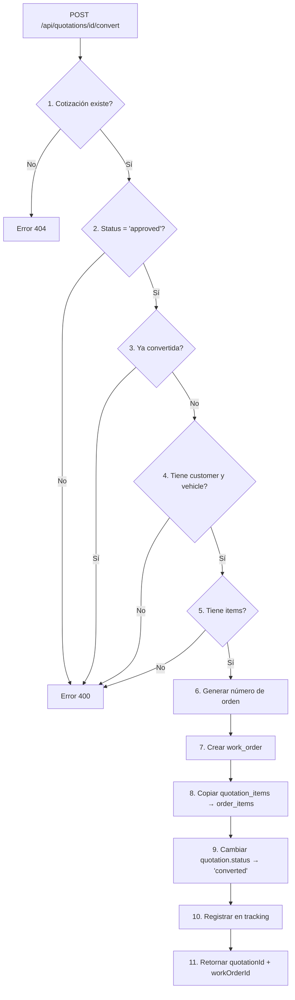

# 🔄 Conversión de Cotización a Orden de Trabajo

## 🎯 **RESUMEN**

Sistema completo para convertir cotizaciones aprobadas en órdenes de trabajo, con validaciones exhaustivas, copia automática de items, generación de números únicos, y tracking completo.

---

## 🔗 **ENDPOINT**

### **POST /api/quotations/[id]/convert**

Convierte una cotización aprobada en una orden de trabajo.

---

## 📋 **FLUJO COMPLETO**

### **Proceso de Conversión:**



---

## ✅ **VALIDACIONES IMPLEMENTADAS**

### **1. Validación de Existencia**
```typescript
// Verifica que la cotización existe
if (!quotation) {
  return 404: "Cotización no encontrada"
}
```

### **2. Validación de Estado - CRÍTICA** ⭐
```typescript
// Solo permite convertir cotizaciones aprobadas
if (quotation.status !== 'approved') {
  return 400: "Solo se pueden convertir cotizaciones aprobadas. 
                Estado actual: {status}"
}
```

### **3. Validación de Conversión Previa**
```typescript
// Previene duplicados
if (quotation.status === 'converted') {
  return 400: "Esta cotización ya ha sido convertida a orden de trabajo"
}
```

### **4. Validación de Customer**
```typescript
// Debe tener cliente asignado
if (!quotation.customer_id) {
  return 400: "La cotización debe tener un cliente asignado"
}
```

### **5. Validación de Vehicle**
```typescript
// Debe tener vehículo asignado
if (!quotation.vehicle_id) {
  return 400: "La cotización debe tener un vehículo asignado"
}
```

### **6. Validación de Items**
```typescript
// Debe tener al menos un item
if (!quotationItems || quotationItems.length === 0) {
  return 400: "La cotización debe tener al menos un item para ser convertida"
}
```

---

## 🔧 **PROCESO DETALLADO**

### **Paso 1: Obtener Cotización**
```typescript
const quotation = await getQuotationById(quotationId)

// Incluye automáticamente:
// - customers (id, name, email, phone, address)
// - vehicles (id, brand, model, year, license_plate, vin)
// - quotation_items (todos los items con relaciones)
```

### **Paso 2-6: Validaciones**
Ver sección de Validaciones arriba.

### **Paso 7: Generar Número de Orden**
```typescript
// Usa el sistema de generación automática
const orderNumber = await generateWorkOrderNumber(quotation.organization_id)

// Genera formato: WO-2024-0001, WO-2024-0002, etc.
// Reseteo anual automático
// Único por organización
```

### **Paso 8: Crear Work Order**
```typescript
const workOrderData = {
  organization_id: quotation.organization_id,
  order_number: orderNumber,                    // Generado automáticamente
  customer_id: quotation.customer_id,
  vehicle_id: quotation.vehicle_id,
  status: 'pending',                            // Estado inicial
  description: `Orden generada desde cotización ${quotation.quotation_number}`,
  notes: `Cotización Original: ${quotation.quotation_number}\n\n${quotation.notes}`,
  subtotal: quotation.subtotal || 0,
  tax_amount: quotation.tax_amount || 0,
  discount_amount: quotation.discount_amount || 0,
  total_amount: quotation.total_amount || 0
}

const newWorkOrder = await createWorkOrder(workOrderData)
```

### **Paso 9: Copiar Items (quotation_items → order_items)**
```typescript
// Mapea cada item de cotización a item de orden
const orderItemsData = quotationItems.map(item => ({
  organization_id: quotation.organization_id,
  order_id: newWorkOrder.id,
  item_type: item.item_type,             // 'product' o 'service'
  product_id: item.product_id || null,
  service_id: item.service_id || null,
  description: item.description,
  quantity: item.quantity,
  unit_price: item.unit_price,
  discount_percent: item.discount_percent || 0,
  discount_amount: item.discount_amount || 0,
  tax_percent: item.tax_percent || 0,
  subtotal: item.subtotal || 0,
  tax_amount: item.tax_amount || 0,
  total: item.total || 0,
  notes: item.notes || null
}))

await createOrderItems(orderItemsData)
```

### **Paso 10: Actualizar Estado de Cotización**
```typescript
await updateQuotation(quotationId, {
  status: 'converted',
  converted_at: new Date().toISOString(),
  updated_at: new Date().toISOString()
})
```

### **Paso 11: Registrar en Tracking**
```typescript
await trackQuotationChange(quotationId, 'converted', {
  work_order_id: newWorkOrder.id,
  work_order_number: newWorkOrder.order_number,
  items_count: orderItemsData.length,
  total_amount: quotation.total_amount
})
```

---

## 🔄 **ROLLBACK AUTOMÁTICO**

### **Si Falla Creación de Items:**
```typescript
if (orderItemsError) {
  // Eliminar work_order creada
  await deleteWorkOrder(newWorkOrder.id)
  return error
}
```

### **Si Falla Actualización de Cotización:**
```typescript
if (updateQuotationError) {
  // Eliminar order_items creados
  await deleteOrderItems(newWorkOrder.id)
  // Eliminar work_order creada
  await deleteWorkOrder(newWorkOrder.id)
  return error
}
```

---

## 📤 **REQUEST**

### **Endpoint:**
```http
POST /api/quotations/123e4567-e89b-12d3-a456-426614174000/convert
Content-Type: application/json
```

### **Body:**
```json
{}
```
*No requiere body, solo el ID en la URL*

---

## 📥 **RESPONSES**

### **Éxito (200):**
```json
{
  "data": {
    "quotation_id": "quote-uuid-123",
    "quotation_number": "Q-2024-0001",
    "work_order_id": "order-uuid-456",
    "work_order_number": "WO-2024-0001",
    "work_order": {
      "id": "order-uuid-456",
      "order_number": "WO-2024-0001",
      "status": "pending",
      "customer": {
        "id": "customer-uuid",
        "name": "Juan Pérez",
        "email": "juan@example.com",
        "phone": "555-1234"
      },
      "vehicle": {
        "id": "vehicle-uuid",
        "brand": "Toyota",
        "model": "Corolla",
        "year": 2020,
        "license_plate": "ABC-123"
      },
      "subtotal": 1000.00,
      "tax_amount": 160.00,
      "discount_amount": 50.00,
      "total_amount": 1110.00,
      "items_count": 3
    },
    "message": "Cotización Q-2024-0001 convertida exitosamente a orden WO-2024-0001"
  },
  "error": null
}
```

### **Error: Cotización no encontrada (404):**
```json
{
  "data": null,
  "error": "Cotización no encontrada"
}
```

### **Error: Estado inválido (400):**
```json
{
  "data": null,
  "error": "Solo se pueden convertir cotizaciones aprobadas. Estado actual: draft"
}
```

### **Error: Ya convertida (400):**
```json
{
  "data": null,
  "error": "Esta cotización ya ha sido convertida a orden de trabajo"
}
```

### **Error: Sin cliente (400):**
```json
{
  "data": null,
  "error": "La cotización debe tener un cliente asignado"
}
```

### **Error: Sin vehículo (400):**
```json
{
  "data": null,
  "error": "La cotización debe tener un vehículo asignado"
}
```

### **Error: Sin items (400):**
```json
{
  "data": null,
  "error": "La cotización debe tener al menos un item para ser convertida"
}
```

### **Error: Fallo en creación (500):**
```json
{
  "data": null,
  "error": "Error al crear orden de trabajo: [detalles]"
}
```

---

## 💡 **EJEMPLOS DE USO**

### **Ejemplo 1: Conversión Exitosa**

```javascript
// 1. Aprobar cotización primero
await fetch('/api/quotations/quote-123', {
  method: 'PUT',
  body: JSON.stringify({ status: 'approved' })
})

// 2. Convertir a orden
const response = await fetch('/api/quotations/quote-123/convert', {
  method: 'POST'
})

const { data, error } = await response.json()

if (data) {
  console.log('Orden creada:', data.work_order_number)
  console.log('ID de orden:', data.work_order_id)
  console.log('Items copiados:', data.work_order.items_count)
  
  // Redirigir a la orden creada
  window.location.href = `/ordenes/${data.work_order_id}`
}
```

### **Ejemplo 2: Manejo de Errores**

```javascript
const response = await fetch('/api/quotations/quote-123/convert', {
  method: 'POST'
})

const { data, error } = await response.json()

if (error) {
  if (error.includes('aprobadas')) {
    alert('La cotización debe estar aprobada primero')
  } else if (error.includes('convertida')) {
    alert('Esta cotización ya fue convertida')
  } else if (error.includes('cliente')) {
    alert('Debes asignar un cliente a la cotización')
  } else if (error.includes('vehículo')) {
    alert('Debes asignar un vehículo a la cotización')
  } else if (error.includes('items')) {
    alert('La cotización debe tener al menos un item')
  } else {
    alert(`Error: ${error}`)
  }
}
```

### **Ejemplo 3: Flujo Completo**

```javascript
// Flujo completo: crear cotización → aprobar → convertir
async function createAndConvertQuotation() {
  // 1. Crear cotización
  const createRes = await fetch('/api/quotations', {
    method: 'POST',
    body: JSON.stringify({
      customer_id: 'customer-uuid',
      vehicle_id: 'vehicle-uuid',
      description: 'Mantenimiento general',
      valid_until: '2024-12-31'
    })
  })
  const { data: quotation } = await createRes.json()
  
  // 2. Agregar items
  await fetch(`/api/quotations/${quotation.id}/items`, {
    method: 'POST',
    body: JSON.stringify({
      item_type: 'service',
      service_id: 'service-uuid',
      description: 'Cambio de aceite',
      quantity: 1,
      unit_price: 500.00,
      tax_percent: 16
    })
  })
  
  // 3. Aprobar cotización
  await fetch(`/api/quotations/${quotation.id}`, {
    method: 'PUT',
    body: JSON.stringify({ status: 'approved' })
  })
  
  // 4. Convertir a orden
  const convertRes = await fetch(`/api/quotations/${quotation.id}/convert`, {
    method: 'POST'
  })
  const { data: conversion } = await convertRes.json()
  
  console.log('Cotización convertida:', conversion.work_order_number)
  return conversion
}
```

---

## 📊 **TRACKING DE CONVERSIÓN**

### **Registro en quotation_tracking:**

```typescript
{
  quotation_id: "quote-uuid",
  action: "converted",
  details: {
    work_order_id: "order-uuid",
    work_order_number: "WO-2024-0001",
    items_count: 3,
    total_amount: 1110.00
  },
  created_at: "2024-01-20T15:30:00Z"
}
```

### **Consultar Tracking:**

```sql
-- Ver historial de conversiones
SELECT 
  q.quotation_number,
  qt.created_at as converted_at,
  qt.details->>'work_order_number' as order_number,
  qt.details->>'items_count' as items_copied,
  qt.details->>'total_amount' as total
FROM quotation_tracking qt
JOIN quotations q ON qt.quotation_id = q.id
WHERE qt.action = 'converted'
ORDER BY qt.created_at DESC;
```

---

## 🔒 **SEGURIDAD Y VALIDACIONES**

### **Checklist de Seguridad:**

- ✅ **Validación de existencia** de cotización
- ✅ **Validación de estado** (solo 'approved')
- ✅ **Prevención de duplicados** (ya convertida)
- ✅ **Validación de datos requeridos** (customer, vehicle, items)
- ✅ **Rollback automático** en caso de error
- ✅ **Tracking completo** de la operación
- ✅ **Generación segura** de números únicos
- ✅ **Transaccionalidad** de la conversión
- ✅ **Copia completa** de todos los campos relevantes
- ✅ **Mantenimiento de relaciones** (productos, servicios)

---

## 📈 **MÉTRICAS Y REPORTES**

### **Tasa de Conversión:**

```sql
-- Porcentaje de cotizaciones convertidas
SELECT 
  COUNT(*) FILTER (WHERE status = 'converted') * 100.0 / COUNT(*) as conversion_rate
FROM quotations
WHERE created_at >= NOW() - INTERVAL '30 days';
```

### **Tiempo Promedio de Conversión:**

```sql
-- Tiempo desde creación hasta conversión
SELECT 
  AVG(converted_at - created_at) as avg_time_to_convert
FROM quotations
WHERE status = 'converted'
  AND created_at >= NOW() - INTERVAL '30 days';
```

### **Cotizaciones Pendientes de Conversión:**

```sql
-- Cotizaciones aprobadas pero no convertidas
SELECT 
  quotation_number,
  customer_id,
  total_amount,
  EXTRACT(DAY FROM NOW() - updated_at) as days_since_approval
FROM quotations
WHERE status = 'approved'
ORDER BY updated_at ASC;
```

---

## 🚀 **MEJORAS FUTURAS**

### **Funcionalidades Sugeridas:**

1. **Conversión Parcial**: Permitir seleccionar items específicos
2. **Programación**: Agendar fecha de inicio de trabajo
3. **Asignación Automática**: Asignar técnico al crear orden
4. **Notificaciones**: Alertar al cliente sobre conversión
5. **Reserva de Stock**: Reservar productos al convertir
6. **Workflow Approval**: Múltiples niveles de aprobación
7. **Histórico**: Ver cotizaciones origen desde orden

### **Ejemplo de Conversión Parcial:**

```typescript
// Futuro endpoint
POST /api/quotations/{id}/convert
{
  "items_to_convert": ["item-1", "item-3"],  // Solo algunos items
  "scheduled_start": "2024-02-01T09:00:00Z",
  "assigned_technician": "tech-uuid"
}
```

---

## 📚 **REFERENCIAS**

- **API Route**: `src/app/api/quotations/[id]/convert/route.ts`
- **Quotations Queries**: `src/lib/database/queries/quotations.ts`
- **Work Orders Queries**: `src/lib/database/queries/work-orders.ts`
- **Order Items Queries**: `src/lib/database/queries/order-items.ts`
- **Number Generation**: `NUMBER_GENERATION_SYSTEM.md`
- **Tracking System**: `QUOTATIONS_VERSIONING_TRACKING.md`

---

**✅ Sistema de Conversión Implementado**
**🔐 Con Validaciones Exhaustivas**
**🔄 Con Rollback Automático**
**📊 Con Tracking Completo**
**🎯 Copia Completa de Items**
**🔢 Numeración Automática Única**


